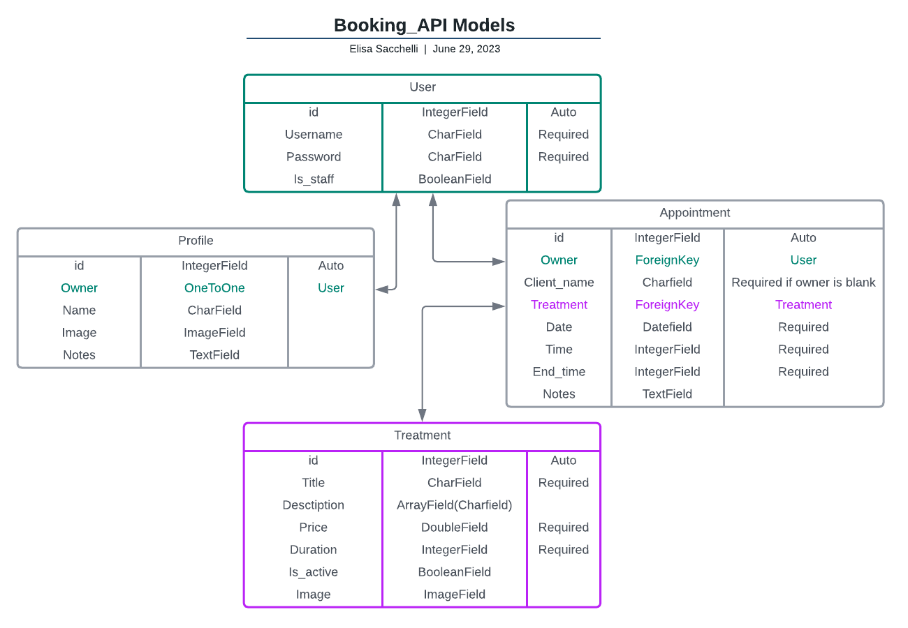

# booking API
Django rest API for a booking system

[See deployed website]()

## Table of content

- [Design and User Experience](#design-and-user-experience)
  - [Design](#design)
  - [User Stories](#user-stories)
  - [Database model](#database-models)

- [Features](#features)
  - [User Profile](#user-profile)
  - [Appointment](#appointment)

- [Testing](#testing)

- [Deployment](#deployment)
  - [Live Website](#live-website)
  - [Local Deployment](#local-deployment)

- [Credits](#credits)
  - [Code](#code)
  - [Content](#content)

- [Technologies used](#technologies-used)

- [Acknowledgements](#acknowledgements)

## Design and User Experience

The web app was developed following the Agile methodology, utilizing the project functionality provided by GitHub
[Link to the project board](https://github.com/users/EliSacch/projects/6/)

### Design

### User Stories

[Back to the top](#table-of-content)

### Database Models

These are the models created for this project: User, Profile, Appointment, Service

- User:
The User model is provided by Django Allauth package.

The following Models are custom:

- Profile:
This custom model is linked to the User model. It is used to store the user profile information.

- Appointment:
It is a model that stores the appointment information. It is linked to the User model, so that each user can access his/her appointments information.

- Service:
To easily manage the services that can be booked, the staff memebers can create and manage them via the service model.

[Back to the top](#table-of-content)

__________

## Features 

### Profile

When a user is registered, the user profile is automatically created.

- __Profile Image__

- __Role__

- __Notes__

### Appointment

Each user can create a new appointment for themselves. Users with a "Staff" role, can create an appointment for any user.

- __Date and time__

- __Service__

- __Notes__

[Back to the top](#table-of-content)

__________

## Testing 

Check testing [here](testing.md)

______________

## Deployment

### Live website

To deply this project on Heroku I followed these steps:
  1. Access my Heroku account (or create one)
  2. Click on Add App
  3. Go to Settings > Config Vars
  4. Add the config KEY and VALUE from my env.py file
  5. Go to deploy tab
  6. Select GitHub as deploy method
  7. Select the relevant GitHub repository
  8. Click on deploy branch

### Local Deployment

For a local deployment follow these steps:
  - Create a new directory on your machine, where you want do deploy the files
  - Open the existing repository in GitHub
  - Go to the "Code" tab
  - Click on the "Code" button
  - Copy the HTTPS link
  - Open your terminal and run the command __git clone 'link'__
  - use the link just copied, without quotes, instead of 'link'

[Back to the top](#table-of-content)

_____________

## Credits 

### Code

- The code to ####### is taken from [Link]()
- 
### Content

- The models relationship diagram was drawn using [Lucidchart](https://www.lucidchart.com/pages/)

[Back to the top](#table-of-content)

_____________

## Technologies used

Languages used:
  - Python
  - Django

Other libraries:

Python libraries:

Django libraries, frameworks and applications:
  - Django-cloudinary-storage - To connect our Django project to Cloudinary
  - Pillow - To add image processing capabilities to our project
  - Django REST framework - To build the web API

Database and storage:
  - PostgreSQL - Relational database system
  - Psycopg2 - PostgreSQL database adapter for the Python programming language
  - ElephantSQL - Host for the databased used by the live website
  - Cloudinary - To store the images and static files
  
[Back to the top](#table-of-content)

## Acknowledgements

A special thank to my mentor __Dick Vlaanderen__ for his precious feedback on this project.
