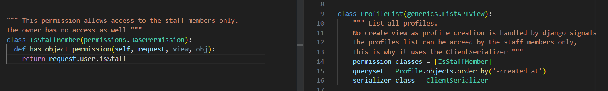
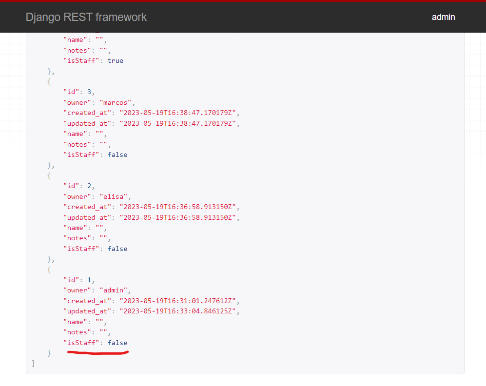
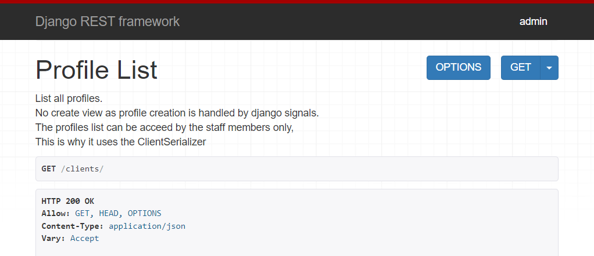
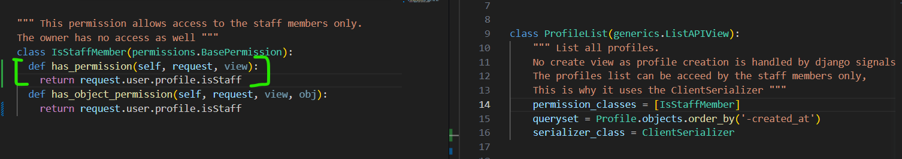
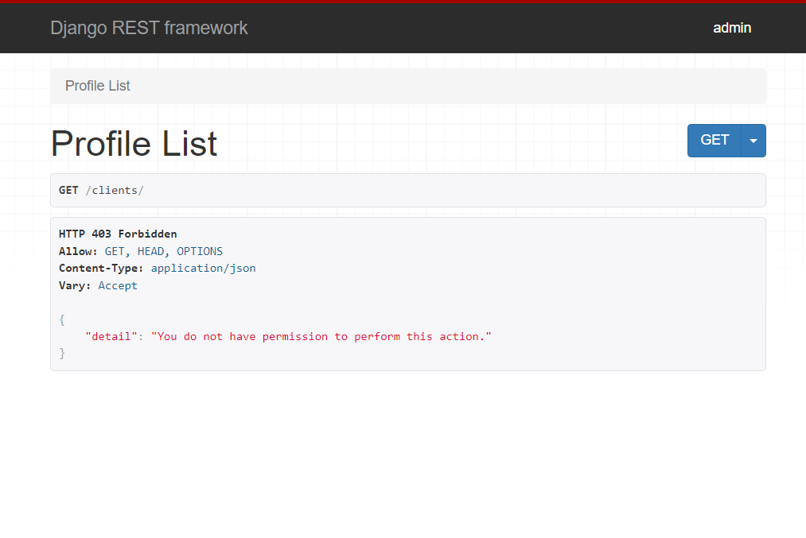

# Testing

Back to [main README](readme.md)

## Table of content

[Tests](#tests)
  - [Unit test](#unit-test)
  - [Manual test](#manual-test)

[Validator Testing](#validator-testing)
  - [Python](#python)

[Fixed bugs](#fixed-bugs)

[Unfixed bugs](#unfixed-bugs)

[Performance](#performance)

## Tests

### Unit test

### Manual test

View

| Action | Expected result | Pass/Fail |
|--------|-----------------|-----------|
|  |  | Pass/Fail |
|  |  | Pass/Fail |
|  |  | Pass/Fail |
|  |  | Pass/Fail |

[Back to the top](#table-of-content)

## Validator Testing

### Python

The final version of python files was checked using [CI Python Linter](https://pep8ci.herokuapp.com/#)

Se scrrenshots below:

  
File

  

[Back to the top](#table-of-content)

## Fixed Bugs

  
 Custom IsStaffMember permission not working on generics.ListAPIView:

  - Issue: 
  
    The ProfileList view should be accessed by staff members only. This is because only staff members can see all the profiles, while each client cannot see the other clients (each client can only access their own profile).
    
    This was working only in the ClientProfileDetail view (RetrieveUpdateAPIView), but not in the ProfileList (ListAPIView)

As we can see the user 'admin' has the attribute isStaff set to 'false':

But they can access the ProfileList:

While they cannot access the client profile, as expected, since the user 'admin' is not part of the staff, so they should not be able to see the client profiles:

  - Fix:

  After throubleshooting I could identify that the issue is caused by the use of ListAPIView.

  As we see from the Django REST framework documentation: https://www.django-rest-framework.org/api-guide/permissions/#custom-permissions

  We can create a custom permission by overriding the BasePermission. Although we have 2 methos to do so:

  has_permission (global) and has_object_permission (object-level)

  The IsStaffMember was initially overriding just the has_object_permission, which is used at object level views, such as the RetrieveUpdateAPIView. While the ListApiView checks for global permissions.

  To fix this issue I had to override the has_permission method as well:
  

  After this fix, our user 'admin' cannot access the clients list anymore:
  
  

  
 Title:

  - Issue: 

  - Fix:

 
## Unfixed Bugs

There are currently 0 known unfixed bugs

[Back to the top](#table-of-content)

## Performance

[Back to the top](#table-of-content)

Back to [main README](readme.md)